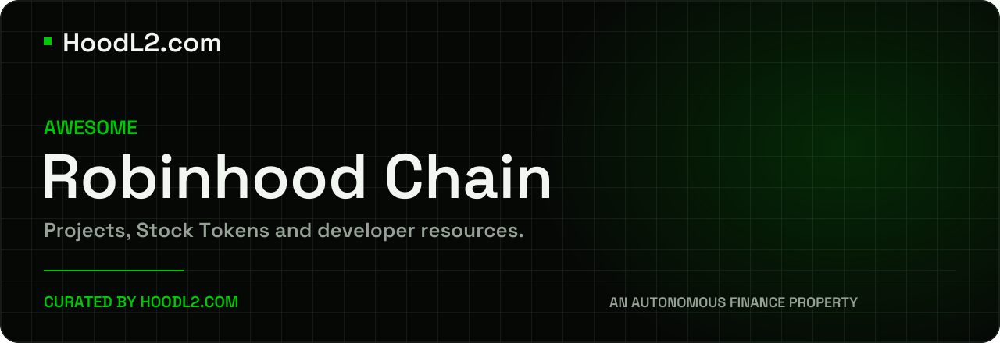

[](https://hoodl2.com)

# Awesome Robinhood Chain

A curated list of Robinhood Chain projects, developer resources and Stock Token research, maintained by **[HoodL2.com](https://hoodl2.com)**, an Autonomous Finance property.

**[All 129 directory records](directory/README.md) · [Developer references](#build-on-robinhood-chain) · [Issuer research](#stock-tokens-and-issuer-comparisons)**

Reviewed **8 September 2026**. Project names link directly to project websites, apps or documentation. HoodL2 is independent of Robinhood and is not an official Robinhood publication.

## Contents

- [Start here](#start-here)
- [Network reference](#network-reference)
- [Exchanges and liquidity](#exchanges-and-liquidity)
- [Lending and stablecoins](#lending-and-stablecoins)
- [Bridges and interoperability](#bridges-and-interoperability)
- [RPC and developer infrastructure](#rpc-and-developer-infrastructure)
- [Oracles and data](#oracles-and-data)
- [Wallets and institutional services](#wallets-and-institutional-services)
- [More ecosystem projects](#more-ecosystem-projects)
- [Agents and automation](#agents-and-automation)
- [Stock Tokens and issuer comparisons](#stock-tokens-and-issuer-comparisons)
- [Build on Robinhood Chain](#build-on-robinhood-chain)
- [Further reading](#further-reading)
- [Directory and data](#directory-and-data)
- [Contribute](#contribute)

## Start here

- [Official Robinhood Chain documentation](https://docs.robinhood.com/chain/): network setup, contracts and integration guides.
- [Mainnet explorer](https://robinhoodchain.blockscout.com): inspect transactions, addresses and contracts.
- [Network status](https://status.robinhoodchain.offchain.io): operator status page.
- [Governance](https://docs.robinhood.com/chain/governance/): upgrade authority, security council and operational controls.

## Network reference

| Setting | Mainnet | Testnet |
| --- | --- | --- |
| Chain ID | `4663` | `46630` |
| Gas currency | ETH | ETH |
| Public RPC | `https://rpc.mainnet.chain.robinhood.com` | `https://rpc.testnet.chain.robinhood.com` |
| Explorer | [Blockscout](https://robinhoodchain.blockscout.com) | [Testnet explorer](https://explorer.testnet.chain.robinhood.com) |

Source: [Robinhood’s connection guide](https://docs.robinhood.com/chain/connecting/), checked 8 September 2026. Public RPC endpoints are rate limited; the guide recommends a provider for production. This is a configuration reference, not an uptime measurement.

## Reading the project list

Core infrastructure entries follow Robinhood’s [ecosystem overview](https://docs.robinhood.com/chain/), [provider list](https://docs.robinhood.com/chain/connecting/) and [bridge documentation](https://docs.robinhood.com/chain/bridging/), supplemented by HoodL2 records. Several projects operate across many chains. Check the exact product, network, supported assets and jurisdiction before using one. Inclusion does not establish endorsement, contract safety or available liquidity.

## Exchanges and liquidity

- [Uniswap](https://uniswap.org): Swaps, liquidity pools and programmable markets. [Docs](https://docs.uniswap.org).
- [Rialto](https://rialto.xyz): Spot exchange using a proprietary AMM; listed in Robinhood’s ecosystem documentation. [Docs](https://docs.rialto.xyz/).
- [Arcus](https://arcus.xyz): Stock Token spot beta for eligible users. Perpetuals use a waitlist and cohort rollout. [Docs](https://docs.arcus.xyz).
- [Lighter](https://robinhoodchain.lighter.xyz): Dedicated Robinhood Chain instance with its own contracts, sequencing and liquidity. [Docs](https://docs.robinhood.com/chain/lighter-domains/).

## Lending and stablecoins

- [Morpho](https://morpho.org): Lending markets and allocation vaults. Check each market’s collateral, oracle and risk parameters. [Docs](https://docs.morpho.org).
- [USDG (Global Dollar)](https://globaldollar.com): USD-backed Global Dollar stablecoin. Read the issuer’s reserve and redemption disclosures.
- [Paxos](https://www.paxos.com): Issuer and financial infrastructure company behind USDG.

## Bridges and interoperability

Available routes vary by asset and network. Start with the [official bridging guide](https://docs.robinhood.com/chain/bridging/) and verify the destination token.

- [Robinhood Chain Bridge](https://docs.robinhood.com/chain/bridging/): Canonical Ethereum connection. Withdrawals require a challenge period and a claim on Ethereum.
- [LayerZero](https://layerzero.network): Cross-chain messaging and omnichain token standards. [Docs](https://docs.layerzero.network).
- [Relay Protocol](https://relay.link): Intent-based bridging and execution on the destination chain. [Docs](https://docs.relay.link).
- [Across](https://across.to): Intent-based asset transfers across supported networks. [Docs](https://docs.across.to).
- [LI.FI](https://li.fi): Aggregates bridge and swap routes. [Docs](https://docs.li.fi).
- [0x](https://0x.org): Trading APIs and routing infrastructure. [Docs](https://0x.org/docs).

## RPC and developer infrastructure

- [Alchemy](https://www.alchemy.com): RPC, indexed data and account abstraction services. [Docs](https://docs.alchemy.com).
- [QuickNode](https://www.quicknode.com): Node endpoints and developer APIs. [Docs](https://www.quicknode.com/docs/robinhood).
- [Blockdaemon](https://www.blockdaemon.com): Node infrastructure and institutional digital-asset services.
- [dRPC](https://drpc.org): RPC endpoints and request monitoring.
- [Validation Cloud](https://www.validationcloud.io): Node access and blockchain infrastructure.
- [Arbitrum](https://arbitrum.io): The underlying chain technology and development documentation. [Docs](https://docs.arbitrum.io).
- [Ethereum](https://ethereum.org): Settlement network and broader Ethereum developer resources. [Docs](https://ethereum.org/developers).

## Oracles and data

- [Chainlink](https://chain.link): Price feeds and cross-chain infrastructure. Stock Token integrations must account for feed freshness and market hours. [Docs](https://docs.robinhood.com/chain/oracles-and-price-feeds/).
- [Blockscout](https://robinhoodchain.blockscout.com): Explorer software for reading transactions, token transfers and verified contracts. [Docs](https://docs.blockscout.com).
- [Allium](https://www.allium.so): Indexed blockchain data for analytics and applications. [Docs](https://docs.allium.so).
- [CoinGecko](https://www.coingecko.com): Token prices, market data and venue coverage.
- [Zerion](https://zerion.io): Wallet data APIs and a multichain self-custody wallet. [Docs](https://zerion.io/api).

## Wallets and institutional services

- [Robinhood Wallet](https://robinhood.com/wallet): Robinhood’s self-custody wallet.
- [BitGo](https://www.bitgo.com): Institutional digital-asset custody.
- [Fireblocks](https://www.fireblocks.com): Custody, tokenization and digital-asset operations.
- [TRM Labs](https://www.trmlabs.com): Blockchain intelligence and transaction monitoring.

## More ecosystem projects

Selected projects from our wider directory. These descriptions summarize our source records and project materials; deployment details and current availability need individual review.

- [Alandale](https://alandale.xyz): Swaps and liquidity incentives using a ve(3,3) model.
- [Ekubo](https://ekubo.org/): Concentrated-liquidity AMM with a singleton contract architecture.
- [Fables](https://www.fables.fi/): Uniswap v4 hooks and ve(3,3) exchange mechanics.
- [Longbow](https://www.longbow.cash): Lending project focused on USDG and tokenized-asset collateral.
- [T3tris Finance](https://t3tris.finance/): Asynchronous ERC-4626 vault infrastructure.
- [TrustSwap](https://trustswap.com/robinhood): Robinhood Chain resources for token launches and liquidity locks.
- [OpenSea](https://opensea.io/discover/chain/robinhood): Token and NFT marketplace with a Robinhood Chain discovery page.
- [Yorozu](https://www.yorozu.gg/): Browser MMO with AI-generated game content.
- [StockRip](https://stockrip.com/): Pack-opening game using tokenized stocks.
- [Sounder Liquidity](https://www.sounderliq.app/docs): Liquidity-depth and venue-dispersion analytics.

## Agents and automation

Agent tools differ in wallet permissions and execution controls. Review wallet permissions and contract deployments in the project’s documentation before granting access.

- [Aeron](https://github.com/aeronlabs): Agent software and public repositories for real-world assets.
- [Project:VEX](https://www.projectvex.ai): Desktop agent for crypto research and onchain execution.
- [bankrbot](https://bankr.bot): Conversational trading, swaps and token limit orders.
- [Sherwood Protocol](https://sherwood.sh): Vault infrastructure for agent-operated DeFi strategies.
- [wire bot](https://wirebot.trade/docs): Social and web trading interfaces for Robinhood Chain.

## Stock Tokens and issuer comparisons

Robinhood Stock Tokens are **tokenized debt securities issued by Robinhood Assets (Jersey) Limited**. They provide economic exposure to underlying shares or ETFs without granting legal or beneficial rights in those underlying securities. Read the [official Stock Token overview](https://docs.robinhood.com/chain/stock-tokens/) and the [issuer’s prospectus and final terms](https://docs.robinhood.com/rhj).

- [HoodL2 Stock Token directory](https://hoodl2.com/stocks): individual token records and linked research.
- [Robinhood Stock Token issuer](https://hoodl2.com/learn/robinhood-stock-token-issuer): entity structure, custody, rights and redemption.
- [Compare Stock Token issuers](https://hoodl2.com/learn/stock-token-issuers-compared): the overview table and differences between product structures.

These comparisons cover distinct issuers, distributors and tokenization models. A comparison page does not mean the provider’s products are issued by Robinhood or available on Robinhood Chain.

The issuer comparison covers Coinbase, xStocks, Ondo, Binance, Dinari, Superstate, Securitize, Swarm and Remora, with links to the individual analyses.

## Build on Robinhood Chain

| Task | Official reference |
| --- | --- |
| Connect a wallet or RPC client | [Network configuration](https://docs.robinhood.com/chain/connecting/) |
| Deploy a contract | [Foundry and Hardhat guide](https://docs.robinhood.com/chain/deploy-smart-contracts/) |
| Identify a Stock Token contract | [Token contracts](https://docs.robinhood.com/chain/contracts/) |
| Integrate Stock Tokens | [Building with Stock Tokens](https://docs.robinhood.com/chain/building-with-stock-tokens/) |
| Read prices | [Oracles and price feeds](https://docs.robinhood.com/chain/oracles-and-price-feeds/) |
| Handle dividends and splits | [Stock Token mechanics](https://docs.robinhood.com/chain/stock-tokens/) |
| Sponsor gas or use smart accounts | [Account abstraction](https://docs.robinhood.com/chain/account-abstraction/) |
| Integrate Lighter’s Robinhood instance | [API documentation](https://apidocs.rh.lighter.xyz/docs/get-started) |
| Run a node | [Full-node guide](https://docs.robinhood.com/chain/run-a-full-node/) |

## Further reading

- [Verify a canonical Stock Token](https://hoodl2.com/learn/verify-a-canonical-stock-token): HoodL2’s guide to checking the contract and issuer.
- [Stock Token prices and oracles](https://hoodl2.com/learn/stock-token-prices-and-oracles): feed freshness, market hours and integration risks.
- [HoodL2 on YouTube](https://www.youtube.com/@hoodl2com): video explainers.

## Directory and data

The [full directory](directory/README.md) contains **129 public HoodL2 records**, grouped by category and searchable with your browser’s Find command. It includes community projects, adjacent infrastructure and entries whose source records still have gaps. It is broader than this curated reading list.

The same snapshot is available as [JSON](data/projects.json), with stable entity slugs, HoodL2 profile URLs and recorded project links. It excludes internal confidence scores and blanket availability labels. The snapshot date is 8 September 2026; [HoodL2.com](https://hoodl2.com/ecosystem) carries subsequent editorial updates.

See [Sources and review notes](SOURCES.md) for provenance, current-source corrections and limits. Maintainers can regenerate the directory from the checked-in JSON with:

```sh
python3 scripts/render_directory.py
python3 scripts/render_directory.py --check
```

## Contribute

Suggest a project, correct a link or add a primary source using [the contribution guide](CONTRIBUTING.md). Include the project’s direct URL, the exact product or deployment, and a dated primary source. Changes are reviewed before inclusion.

---

Maintained by **[HoodL2.com](https://hoodl2.com)** · An **Autonomous Finance** property · Independent Robinhood Chain research.
